How to host a static website on AWS S3 and CloudFront

1. In your AWS account, search for S3 bucket and create
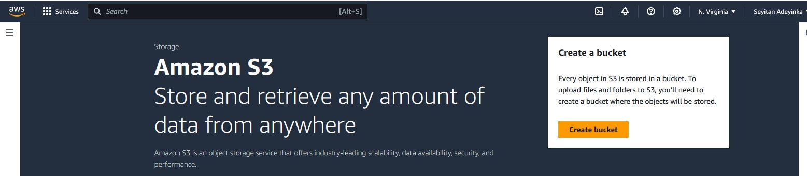

2. Pick a unique bucket name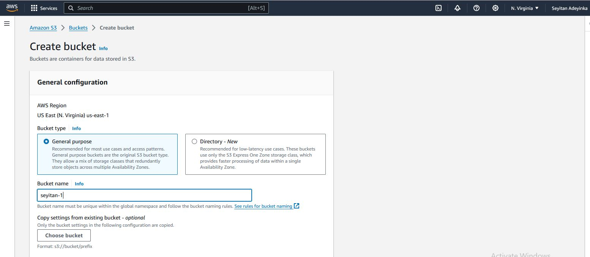

3. Disable ACL and uncheck public access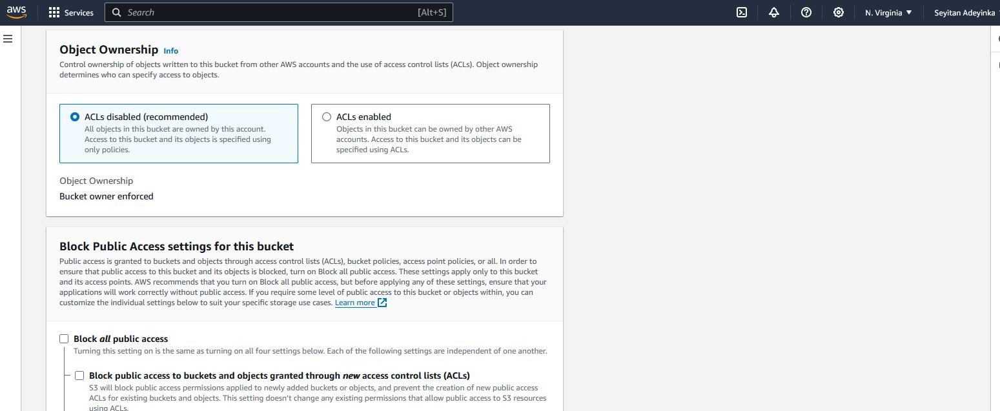

4. Acknowledge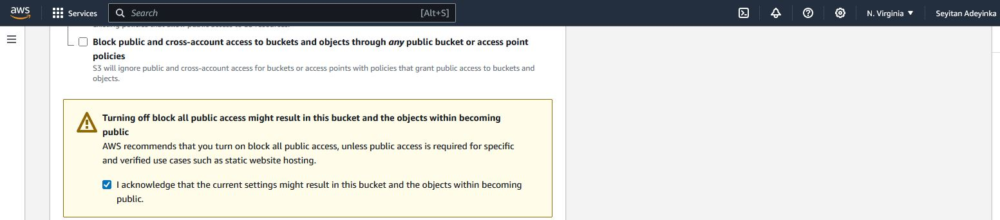

5. Click on create bucket
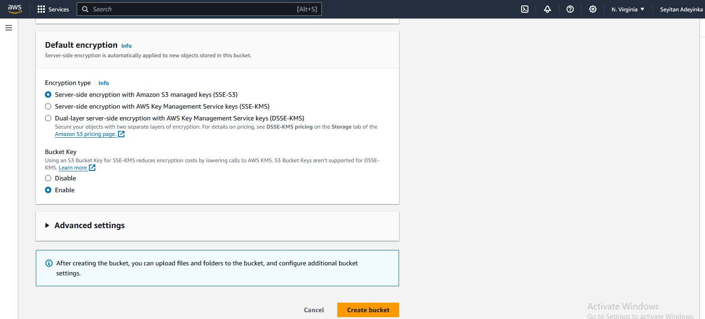

6. Click on the bucket name
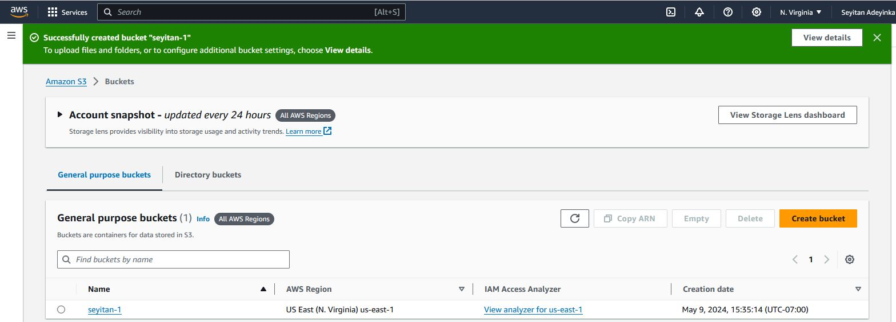

7. Under the 'objects' tab, click to upload files. You will upload the files needed to host your static website. (html file, css and the images).
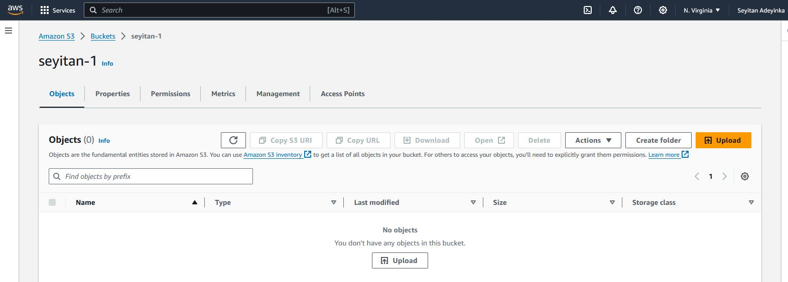

8. Add the files. 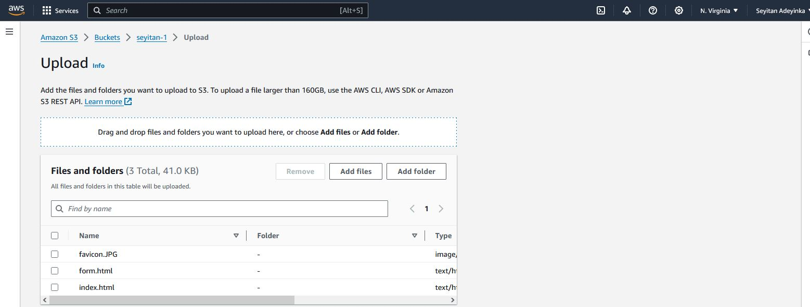

9. Upload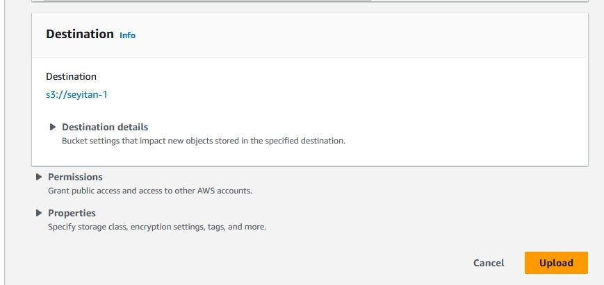

10. Upload successful. You should get this notification status. If you have errors, check your network connection.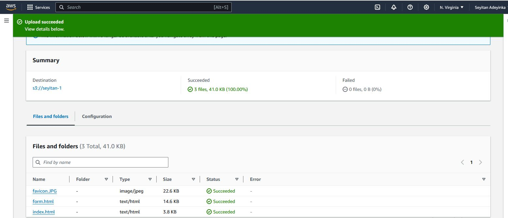

11. Go to your bucket properties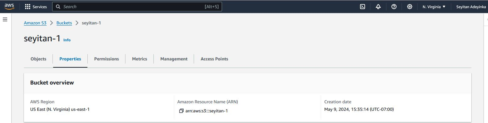

12. Scroll down to enable static website hosting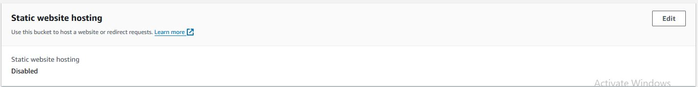

13. Enable static website hosting and type 'index.html' in the index document. 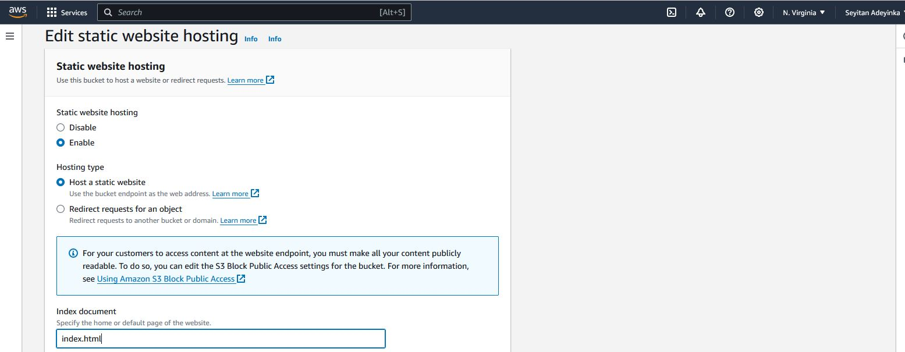

14. Save your changes and reload your page. It will automatically display your website url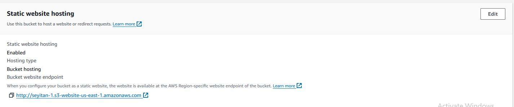

15. Copy the url and paste on your browser. Notice the website url bearing your bucket name. This error pae will pop up. It shows your website has been hosted but you're unable to view its content because you have not added the necessary permissions.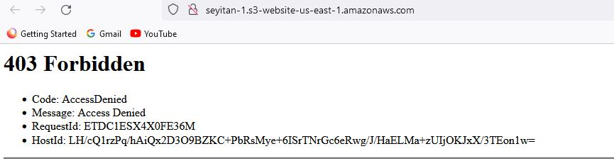

16. To add the necessary permissions for public access, you need to attach a bucket policy. Go to the permissions tab.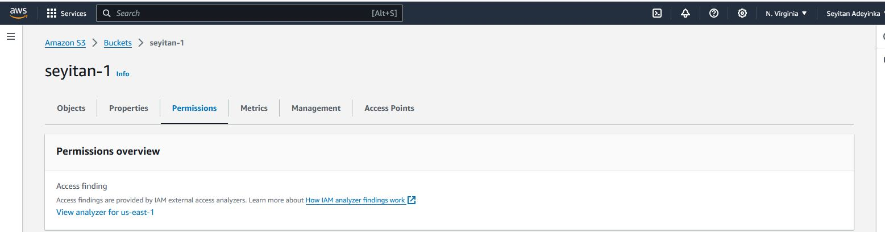

17. Scroll down to bucket policy and edit.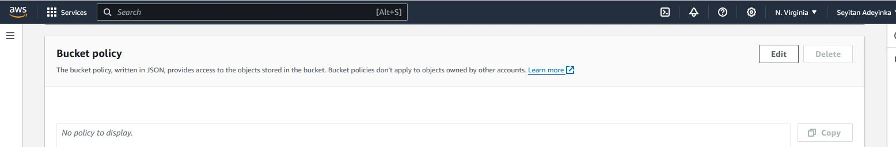

18. Write your policy and save changes. This policy will grant public access.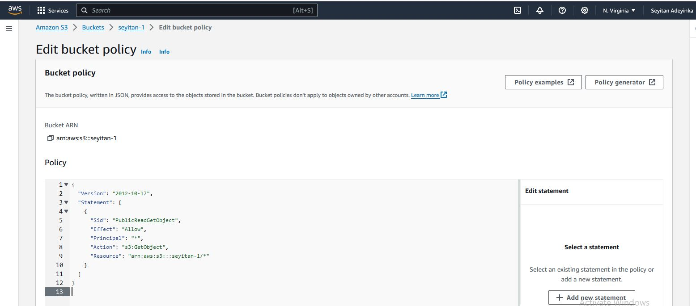

19. Go back to your browser and reload the page. The content of your website is now visible.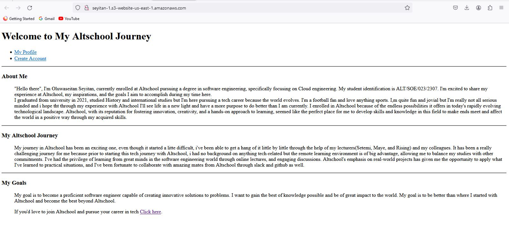

20. The next step is connecting your website to cloudfront. This is done for low latency and high transfer speed in accessing the website. In your management console, search for cloudfront and create.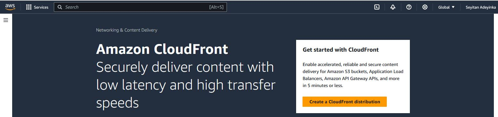

21. Click on origin name and select your newly created bucket. 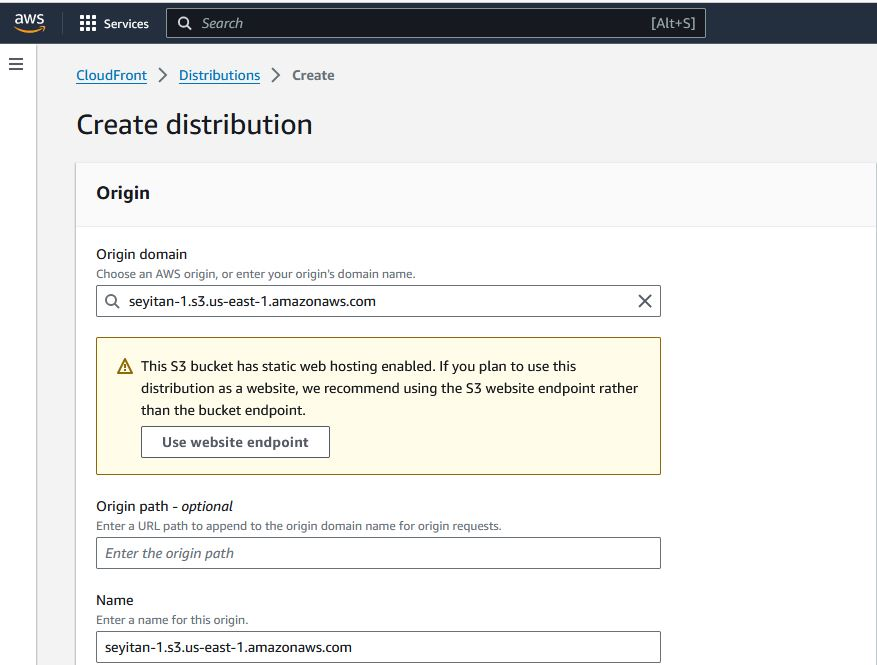

22. Scroll down the page and enable firewall.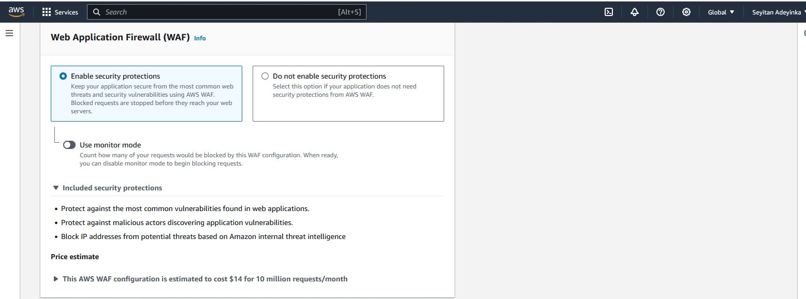

23. Go down to the defaukt root and write 'index.html'. Create your distribution. 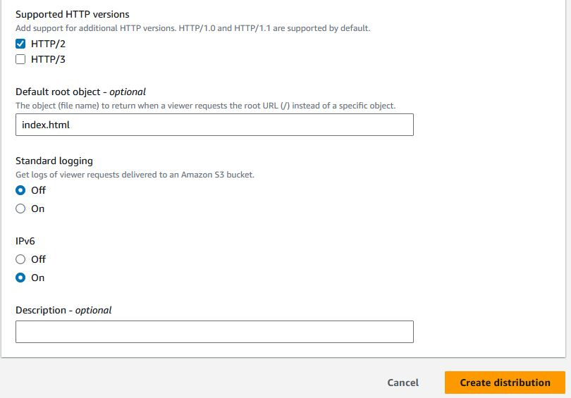

24. Allow the deployment process to be completed. Copy and paste the domain name on your browser. 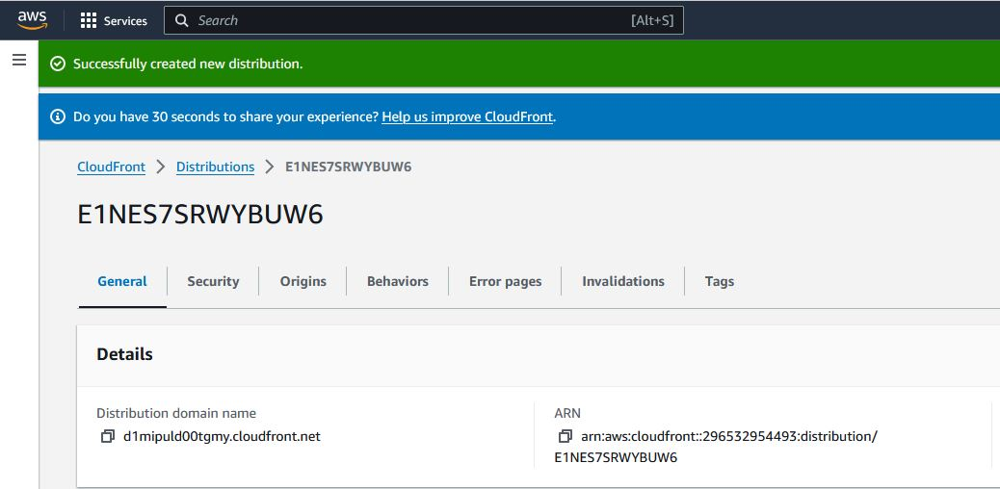

25. Your website now has '.cloudfront.net' extension. 

If you're just practicing and not using this for production,, kindly remember to delete and terminate all the resources you created. Delete the s3 bucket and the cloudfront distribution to avoid billings.